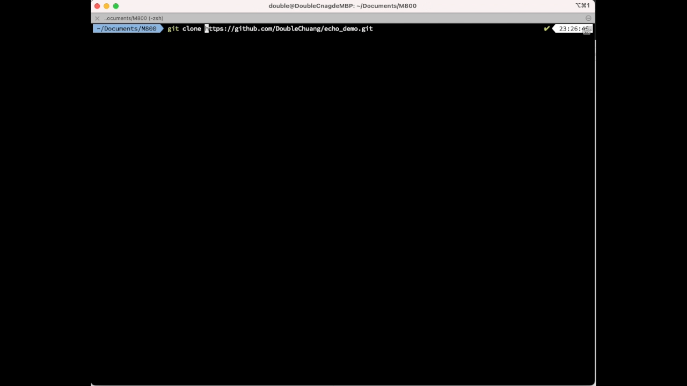
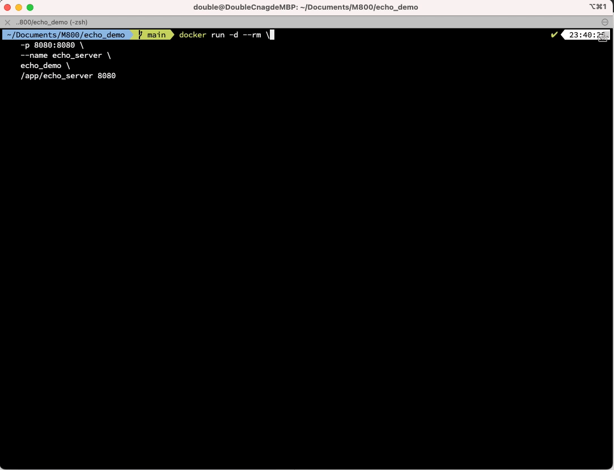
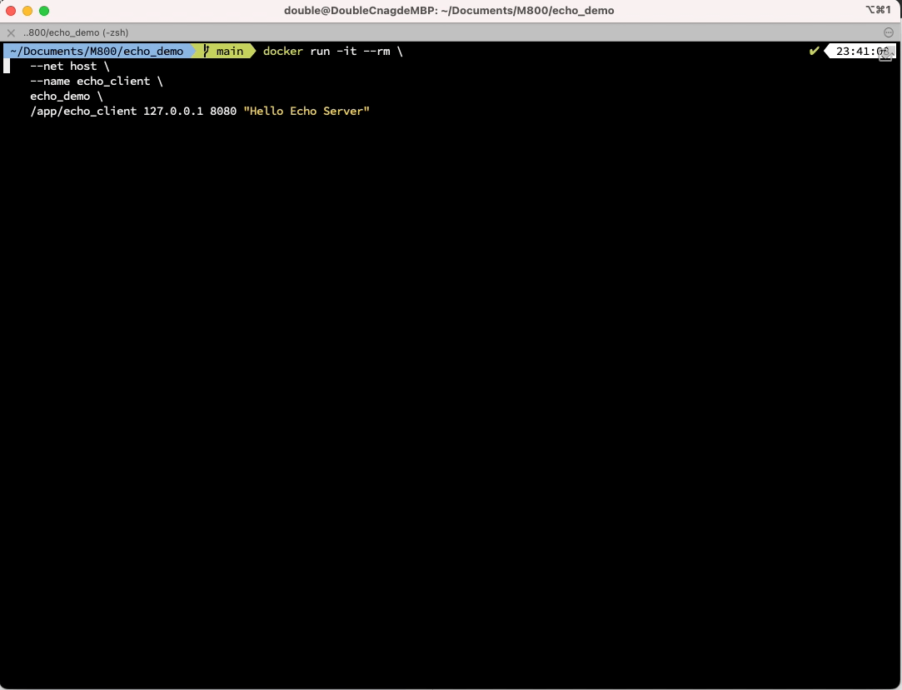
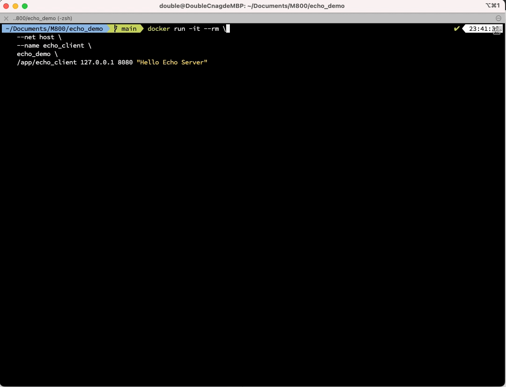

# Echo Server and Client

📘[Documentation]((docs/C%20Assignment%20-%20Echo.pdf))

## Introduction
This is a **M800** assignment written in C.


## How to use it 

#### Use Echo Server with Docker

**Build from Docker**

I provide to build an docker image -- [dockerfile](dockerfile)

```
make build_docker
```


Run `Echo Server` with the following command:

```
docker run -d --rm \
    -p 8080:8080/udp \
    --name echo_server \
    echo_demo \
    /app/echo_server 8080
```

Run `Echo Client` with the following command:

```
docker run -it --rm \
    --net host \
    --name echo_client \
    echo_demo \
    /app/echo_client 127.0.0.1 8080 "Hello Echo Server"
```


You can also use a pre-built Docker image
- [doublehub/echo_demo:latest](https://github.com/users/DoubleChuang/packages/container/package/echo_demo)
- [ghcr.io/doublechuang/echo_demo:latest](https://github.com/users/DoubleChuang/packages/container/package/echo_demo)


Run `Echo Server` with the following command:

```
docker run -d --rm \
    -p 8080:8080 \
    --name echo_server \
    doublehub/echo_demo:latest \
    /app/echo_server 8080
```

Run `Echo Client` with the following command:

```
docker run -it --rm \
    --net host \
    --name echo_client \
    doublehub/echo_demo:latest \
    /app/echo_client 127.0.0.1 8080 "Hello Echo Server"
```


#### Build from Source

Build `Echo server` and `Echo clinet` into `bin` folder with the following command:

```
make all
```

Run `Echo Server` with the following command:

```
bin/echo_server 8080 &
```

Run `Echo Client` with the following command:

```
bin/echo_client 127.0.0.1 8080 "Hello Echo Server"
```

Cleanup objects and binaries
```
make clean
```
